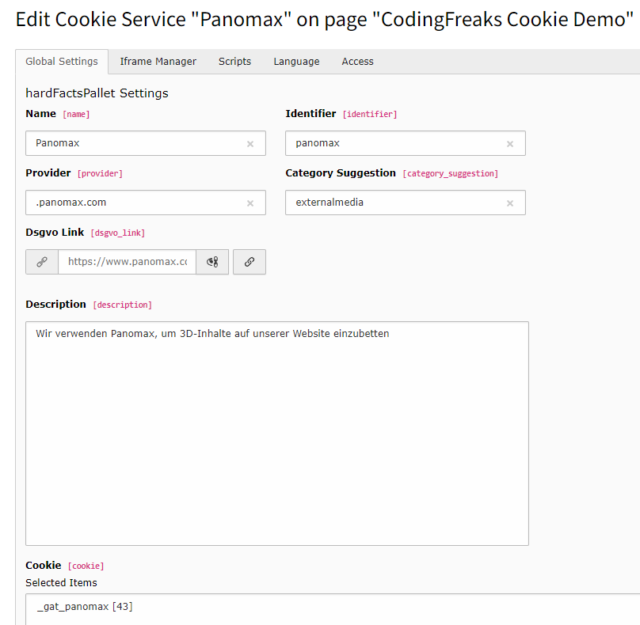

.. include:: ../Includes.txt

===========================
Auto Configuration (Beta)
===========================
This extension is able to automatically configure the cookie categories and services for you.

Please note that the output of this tool may not be completely accurate.

It is intended to assist with analyzing a website's cookie behavior and should not be relied on as the sole source of information.

Use it as a starting point for your analysis.

How to use:
    This is done by using the :ref:`CF-Cookie-API <cookieapi.coding-freaks.com>` service. You can find the configuration in the :guilabel:`Cookie Settings module in the backend.

Please note that the output of this tool may not be completely accurate. It is intended to assist with analyzing a website's cookie behavior and should not be relied on as the sole source of information.

Start Scan
______________________________

By clicking on the Scan button, an external web scanner will scan 10 pages of your website and detect any embedded scripts, iframes, and cookies.

These can be imported using the Import button after a successful scan.

Existing services will be ignored and only new services will be added if they are detected.

You can use a custom sitemap.xml to target the 10 Pages. (ex. https://cookiedemo.coding-freaks.com/mysitemap.xml)

Scan Reports from your Website
______________________________

Easily and efficiently manage your services with Autoconfiguration.

Here, you can easily import any discovered services on your website.

If you want to learn more about your scans, simply click on the "Open Report" button. This link will take you to our detailed report website, where you will receive a complete overview of all your imported services, iFrames, and scripts.

Ensure your services are always up-to-date and up-to-standards by easily and quickly scanning your website.

Scanning & importing
______________________________

By clicking on the Scan button, an external web scanner is called up, which analyzes the website and outputs the Scan Report table.

The Cookie consent ins accepted by default to find all cookies.

If you want to scan the website without accepting the cookie consent, or use custom settings to assist you by finding Services, you can use the public scanner on https://cookieapi.coding-freaks.com/ or the API (currently not documented).

These can be imported using the Import button after a successful scan and then edited as required.

Existing services will be ignored and only new services will be added if they are detected.

:guilabel:`Important: Unknown Services are ignored, and needed to be added manually.

This can be found on the Report page, by clicking on the :guilabel:`Open Report button.

Unknown Services have no Identifier and you need to set the Provider in the Cookie Service manually.

As example the Scanner or your found an Service like:

- Provider: grimming.panomax.com/.
- Cookie: _gat_panomax

The service is unknown, add it now by adding a new Cookie Service in the backend.

The Provider field is used to compare the original URL with the URL from the embedded iframe or script.

You can separate different providers by using a comma. :guilabel:`grimming.panomax.com/,roma.panomax.com` or simply use the domain name :guilabel:`.panomax.com to match all subdomains.

