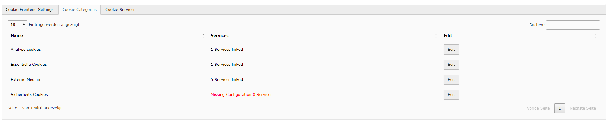
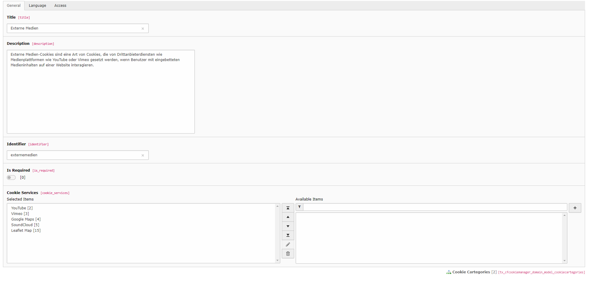

.. include:: ../Includes.txt

=============
Cookie Categories
=============

A category is defined as a broad term.

Services are assigned to each category.

Example
=======

Example: :guilabel:`External Media` contains :guilabel:`Youtube` and :guilabel:`Vimeo`

