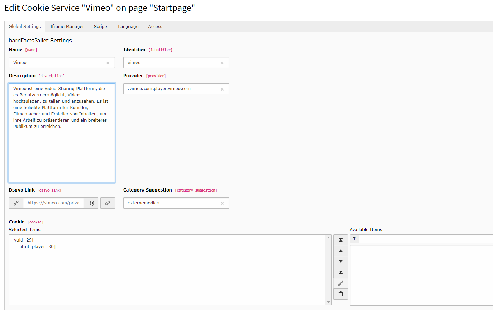
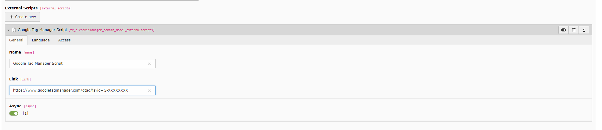
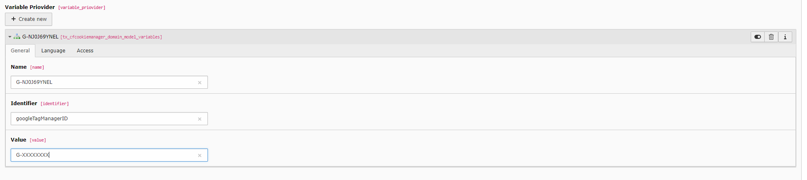

=============
Cookie Services
=============

A cookie service allows for the management of scripts, cookies, and iframes.

For example: :guilabel:`Thirdparty Scripts and Iframe Manager`.

Global Settings
===============

- :guilabel:`name` Display Name in Frontend
- :guilabel:`identifier` System Identifier (do not change)
- :guilabel:`description` Service Description
- :guilabel:`provider` Provider URLS seperated by ","
- :guilabel:`dsgvo_link` Link to Service AGB's
- :guilabel:`category_suggestion` Used for simple MM Selection

Iframe Manager
---------------------

The iframe manager is responsible for blocking third-party content.

In the field,   :guilabel:`iframe_notice` text is stored that the user sees when the content is blocked.

-  :guilabel:`iframe_load_btn` Loads the Content of current Div
-  :guilabel:`iframe_load_all_btn` Loads all Content from same Service on same site

Since version 1.7.0, the Iframe Manager includes a thumbnail feature that displays a placeholder image for blocked iframe content until the user consents to the service.
By default, the thumbnail is autogenerated, but it can be customized by providing a valid URL or by using a JavaScript function in the Backend "Cookie-Service" configuration.

If no custom thumbnail is provided, the Iframe Manager will fallback to a default image, which is stored at :guilabel:`/typo3temp/assets/cfthumbnails/*`, they are generated automatically and cached for 7 days.
Using the Thumbnail-API can be disabled in the Extension Settings.

Advanced Iframe Configuration
---------------------

:guilabel:`iframe_thumbnail_url` set valid url for automatic thumbnails or use a Javascript function

:guilabel:`iframe_embed_url` is called on Successful Accept can also use a Javascript function

Example Iframe Thumbnail function

.. code-block:: javascript
   :linenos:

    function(id, callback){
      let parts = id.split("/");
      let videoId = parts[parts.length - 1];
      let videoIdParts = videoId.split("?");
      let videoIds = videoIdParts[0];
      var url = "https://vimeo.com/api/v2/video/"+videoIds +".json";
      var xhttp = new XMLHttpRequest();
      xhttp.onreadystatechange = function() {
        if (this.readyState == 4 && this.status == 200) {
          var src = JSON.parse(this.response)[0].thumbnail_large;
          callback(src);
        }
      };
      xhttp.open("GET", url, true);
      xhttp.send();
    }

Advanced Iframe Styling (Boostrap Package or Text-Media)
---------------------

If you want to adjust the iframe styling or have responsive issues in combination with the Bootstrap package or other CSS-Ratio hacks, such as the height of the iframe being rendered incorrectly, you can adjust the iframe styling.

We have some default parameters that we set, such as min-height or min-width, which you can easily override with this code at the service level.

.. code-block:: css
   :linenos:

     .your-container-wrapper div[data-service="(service-identifier-from-db)"] { min-width: auto; }

     .my-widget div[data-service="youtube"] { min-width: auto; }

If you are using the Text-Media element with a CSS padding hack such as `padding-top: 56.25%, or (.embed-responsive-16by9:before..)` you can adjust the iframe styling as follows.

Set the `.embed-responsive` to `position: relative;` and the iframe-pseudo-div to `position: absolute;`.

.. code-block:: css
   :linenos:

       .embed-responsive{
         position: relative;
       }

      .embed-responsive [data-autoscale] {
          position: absolute;
          top: 0;
          bottom: 0;
          left: 0;
          width: 100%;
          height: 100%;
          border: 0;
      }

Script Configuration
---------------------

OptInCode :guilabel:`opt_in_code` is executed when the user accepts the service.
By default, some services do not have an OptInCode as cookie management happens automatically based on the assigned cookies.
This code is only needed to execute additional JavaScript when the user accepts the service.

OptOutCode :guilabel:`opt_out_code` is executed when the user block the service.
By default, some services do not have an OptOutCode as cookie management happens automatically based on the assigned cookies.
This code is only needed to execute additional JavaScript when the user block the service.

Fallback Code [fallback_code] is not in use, TODO.

External Script Configuration
---------------------

External scripts are used for example for Google Analytics.
Including these is easy, here is how to create an external script.

Fields:

- :guilabel:`name` Display and lable name
- :guilabel:`link` The external link
- :guilabel:`async` Embed the script tag asynchronous

.. tip::

   You can provide GET parameters like in this Example: :guilabel:`https://www.googletagmanager.com/gtag/js?id=G-XXXXXXXX`

Variable Provider
===============

Variable providers detect defined variables in the fields :guilabel:`opt_in_code` :guilabel:`opt_out_code` :guilabel:`fallback_code`.

A variable is declared with the  :guilabel:`[##` and closed with   :guilabel:`##]`.
In the Google Analytics service you find this example: :guilabel:`[##googleTagManagerID##]`

Replace :guilabel:`G-XXXXXXXX` with your Google Tag manager ID.

Fields:

- :guilabel:`name` Display and lable name
- :guilabel:`identifier` the Variable in the `[##myvariable##]` like myvariable
- :guilabel:`value` The stored string

.. toctree::
   :maxdepth: 5
   :titlesonly:

   ExampleServices/Index
   GoogleConsentMode/Index

