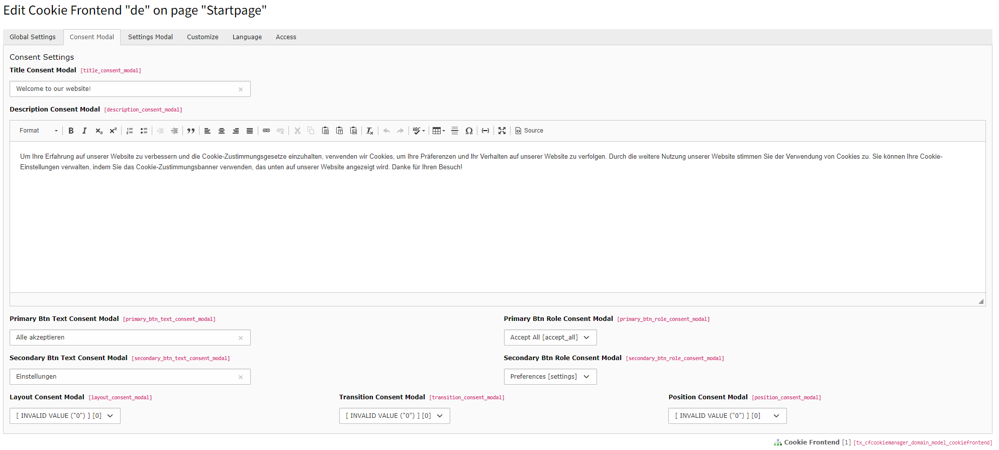
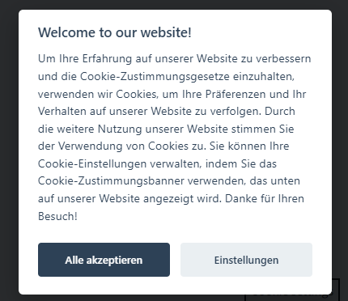
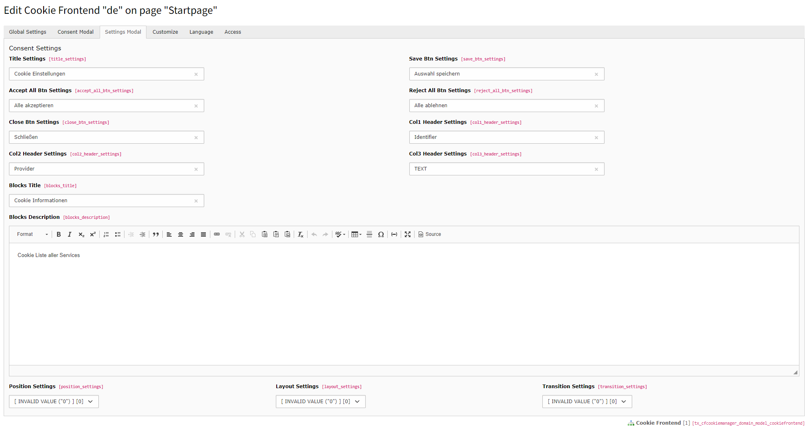

.. include:: ../Includes.txt

=============
Cookie Frontend Settings
=============

In the "Cookie Frontend Settings" tab, settings for the frontend are stored.

For example: :guilabel:`Frontend Consent Modal, Frontend Settings Modal, Frontend Iframe Managers`.

.. _configuration-consent-modal:

Frontend Consent Modal:
======================

From here, you can make advanced settings for the Consent Modal. UI Position, Button Logics, and more.

The layout of the box can be influenced through :guilabel:`layout_consent_modal,transition_consent_modal,position_consent_modal` in the backend.

Default Frontend Preview:
---------------------

.. _configuration-settings-modal:

Frontend Settings Modal
---------------------

The settings modal is the detailed view of individual services and cookie groups.

Here, static texts can be replaced.

.. figure:: ../../Images/cookie_settings.png
   :class: with-shadow
   :alt: Introduction Package
   :width: 100%

Customize Frontend Section
---------------------

The cookie manager offers a field in the frontend settings to override the consent button.

Here, HTML can be inserted to replace the static button, which can then be styled dynamically.

Additionally, there is an option to run the frontend javascript as inline javascript.

This can be changed as desired with :guilabel:`in_line_execution` checkbox.

If you want to override the Consent Template you can set your paths in extension settings of typo3.