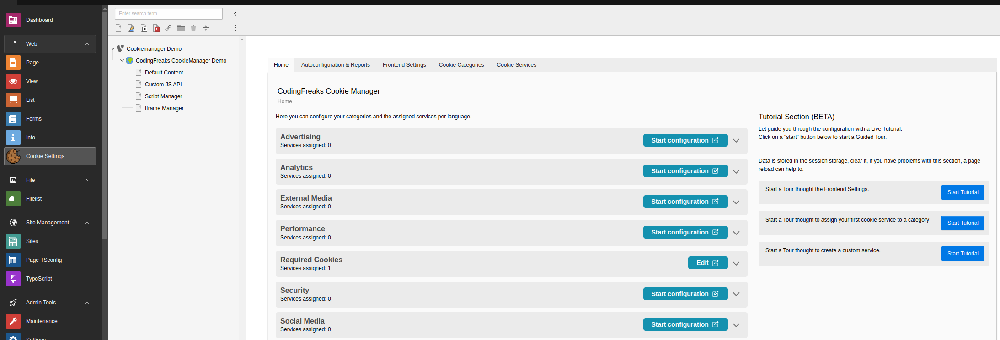

.. _configuration:

=============
Configuration
=============

In general, it is easiest to edit the extension in the backend in the :guilabel:`Cookie Settings` module.

What you should also consider is that you create the settings for the cookie categories and services in the respective language. This means that if you have a multilingual website, you must create the settings for each language.

Tracking
--------

If you want to know how many visitors accept or reject in the banner, enable the tracking
with the setting ``tracking_enabled`` (:guilabel:`Enable Cookie Consent Tracking` in
:guilabel:`Site Management > Settings`).

When active, the visitor's first action in the consent modal is sent to your own TYPO3
site and stored in a local table. Which fields are stored: :ref:`data-consent-tracking`.

You can see the statistics in the TYPO3 Dashboard with the widgets :guilabel:`Cookie Consent Tracking` and :guilabel:`Consent Tracking,  accept types`.

Table of contents.
=================

.. toctree::
   :maxdepth: 5
   :titlesonly:

   AutoConfiguration/Index
   Branding/Index
   CookieCategories/Index
   CookieServices/Index
   ExtensionSettings/Index
   FrontendSettings/Index
