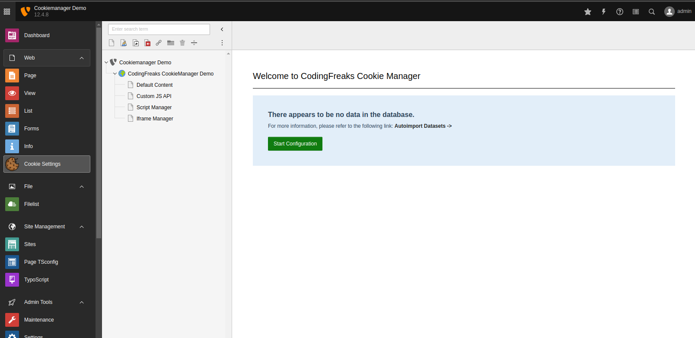

.. include:: ../Includes.txt

.. _installation:

============
Installation
============

To use the CodingFreaks cookie plugin in Typo3, you must first install it in your Typo3 system.
This can be done by using Composer.

.. code-block:: bash

   composer require codingfreaks/cf-cookiemanager

Include TypoScript template (Deprecated since v12)
________________________

To properly use the plugin, it is necessary to include the basic TypoScript provided by the extension.
To do this, go to the :guilabel:`Web > Template` module in the Typo3 backend, select the root page, and switch to the
:guilabel:`Info/Modify` view.

From there, click on :guilabel:`Edit the whole template record`  and switch to the Includes tab.
Next, add the :guilabel:`CodingFreaks Cookie Manager (cf_cookiemanager)` template from the list on the right.

Use Site sets (for Typo3 v13+)
________________________

1. **Add the Site Set in the Backend**:

   - Go to the Typo3 backend.
   - Navigate to **Sites**.
   - Open your site configuration.
   - Add the `CodingFreaks/cf-cookiemanager` Site Set as a dependency.

2. **Alternatively, Use YAML Configuration**:

   You can also add the Site Set directly in your site's `config.yaml` file:

..  code-block:: yaml
   base: 'https://example.com/'
   rootPageId: 1
   dependencies:
     - CodingFreaks/cf-cookiemanager

Backend Installation / Dataset Import
________________________

This extension provides an external API to automatically create cookie assignments to individual services in various languages.

To install the preconfigured data sets, go to the Typo3 backend and select the  :guilabel:`Cookie Settings` module in the Web tab.
Click on Start Configuration and follow the instructions.

   Installation Screen

.. Tip::

    The extension automatically configures itself and creates the corresponding data set and Language overlays from site config.yaml.
    The Locals in the site config.yaml are used for the right language.

You can now Configure the Extension in the :guilabel:`Cookie Settings` module.

.. Tip::
    If the import is unsuccessful:

    Disable the extension via Composer :guilabel:`composer rem codingfreaks/cf-cookiemanager`.

    Remove Mysql-Table fia Typo3 :guilabel:`Database Analyzer`.

    Install Extension again with :guilabel:`composer require codingfreaks/cf-cookiemanager`.

