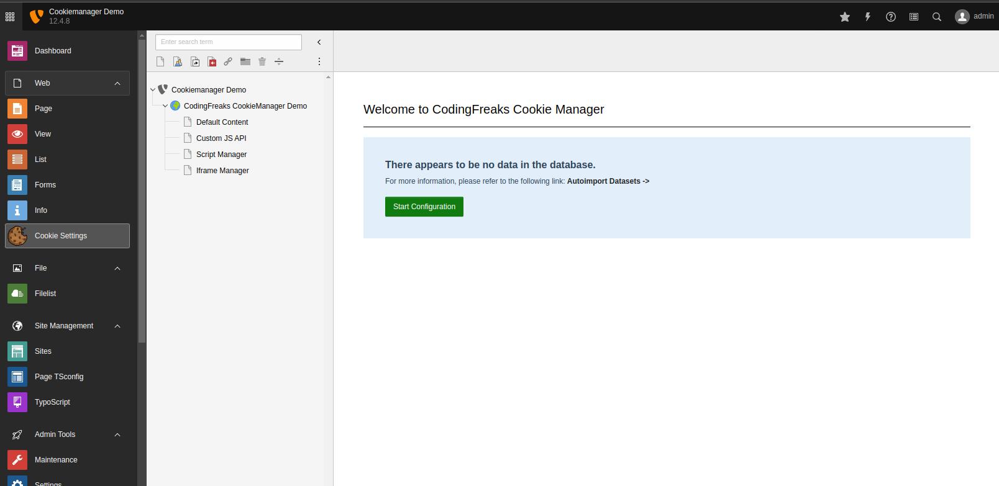

.. _installation:

============
Installation
============

Requirements: TYPO3 13.4.21 or later, or TYPO3 14, and PHP 8.2 or later. The values are
kept in :file:`composer.json` and :file:`ext_emconf.php`.

The steps below use the same names as the TYPO3 integration assistant on the
CodingFreaks platform. Steps 1, 2 and 4 need no account. Step 3 connects the extension to
a platform project and is optional, see :ref:`introduction-platform`.

Step 1: Install the extension
-----------------------------

**Composer** (recommended):

.. code-block:: bash

   composer require codingfreaks/cf-cookiemanager

**Extension Manager**, for projects without Composer: :guilabel:`Admin Tools > Extensions`,
:guilabel:`Get Extensions`, search for ``cf_cookiemanager``, install it with the download
icon and switch it on.

Then update the database schema (:guilabel:`Admin Tools > Maintenance > Analyze Database
Structure`, or ``vendor/bin/typo3 extension:setup``).

Step 2: Include the site set
----------------------------

**Site set** (TYPO3 v13+, recommended):

#.  :guilabel:`Site Management > Sites`, select your root page and click
    :guilabel:`Edit`.
#.  In the :guilabel:`General` tab, open :guilabel:`Sets for this Site`.
#.  Add only :guilabel:`CodingFreaks Cookie Manager Site Configuration (Default)`, and
    check the list before saving.
#.  Save.

Or directly in the site configuration:

..  code-block:: yaml
    :caption: config/sites/<identifier>/config.yaml

    base: 'https://example.com/'
    rootPageId: 1
    dependencies:
      - CodingFreaks/cf-cookiemanager

**Without site sets**: include the static template
:guilabel:`Coding Freaks Cookie Manager (cf_cookiemanager)` in your root template
(:guilabel:`Site Management > TypoScript`, :guilabel:`Edit TypoScript Record`,
:guilabel:`Edit the whole TypoScript record`, tab :guilabel:`Advanced Options`, field
:guilabel:`Include TypoScript sets`). The settings are then
TypoScript constants.

Clear all caches afterwards. The banner stays invisible until the site set or the
template is included.

.. note::

    Does your site package bring its own cookie banner? The Bootstrap Package does. The
    :guilabel:`Cookie Settings` module shows a notice when the Bootstrap Package consent
    is enabled in the site settings. Switch it off, see :ref:`known-problems`.

Step 3: Enter your API credentials (optional)
---------------------------------------------

You need the :guilabel:`API Key` and :guilabel:`API Secret` from step 3 of your
project's TYPO3 assistant on the platform (see :ref:`introduction-platform`). Two ways to
enter them:

*   In the API step of :guilabel:`Start Configuration` (step 4 below). The extension
    checks them against the platform and saves them in the site settings.
*   In the site settings, before or after step 4: :guilabel:`Site Management > Settings`,
    select your site and click :guilabel:`Edit Settings`, open
    :guilabel:`CodingFreaks CookieManager`, fill in :guilabel:`Project ID (API key)` and
    :guilabel:`API secret`, save and clear all caches. For a secret in an environment
    variable, see :ref:`extension-settings-versioned`.

Then check the connection: :guilabel:`Web > Cookie Settings`, tab
:guilabel:`Administration`, button :guilabel:`Check API Integration`. The extension
reports itself to the platform and sends its configuration. The assistant on the platform
shows the extension as connected afterwards.

The extension does not connect to your project by itself. The project only hears from it
when you click :guilabel:`Check API Integration`, pass the API step of
:guilabel:`Start Configuration`, import a scan, or save a record in
:guilabel:`Cookie Settings` (the last two only with key and secret set).

Other requests to the platform happen without credentials: :guilabel:`Start Configuration`
loads the presets from it, and with ``thumbnail_api_enabled`` (default on) your server
requests preview images for blocked iframes when visitors view pages. The full list:
:ref:`data-and-requests`.

.. _autoimport-datasets-for-languages:

Step 4: Import the presets
--------------------------

Open :guilabel:`Web > Cookie Settings` and select the root page. On a fresh installation
the module offers two ways:

*   :guilabel:`Start Configuration` (recommended) loads the presets from the cookie
    database on the platform, for every language of your site. It needs outgoing HTTPS
    from the server, but no account.
*   :guilabel:`Offline Configuration` (intranet or strict network policy): download the
    preset archive, then upload it in the module.

:guilabel:`Start Configuration` walks through three steps:

#.  :guilabel:`Feedback Configuration`: a question about usage data. The answer is stored
    in ``allow_data_collection``. This version sends no usage data either way.
#.  :guilabel:`API Setup (Optional)`: key and secret, see step 3. Skip it to use the
    extension without the platform. If the site settings already hold credentials, the
    step only checks them against the stored endpoint and saves nothing. A failed check
    shows the error, and the wizard goes on.
#.  :guilabel:`Finishing`: the checkbox :guilabel:`Block scripts and iframes that are not
    assigned to a service` (off by default) sets ``script_blocking`` once the import has
    succeeded. It also blocks your site's own JavaScript files unless they carry
    ``data-script-blocking-disabled="true"``, so check your site after enabling it. Then
    click :guilabel:`Install Presets`. If saving the setting fails after a successful
    import, the success dialog shows a warning.

   Installation screen

The extension creates the records and their language overlays from the languages in
your site configuration.

Then check the banner on your site: open the page in a private window, the consent
banner must appear.

What to configure next: :ref:`configuration`. To find the services your site actually
uses, run a scan under :guilabel:`Autoconfiguration & Reports` and import the result, see
:doc:`/Configuration/AutoConfiguration/Index`.

.. tip::

    If the import fails half way, remove the extension's records and start again: delete
    the records on the root page (list module), or drop the extension's tables with
    :guilabel:`Analyze Database Structure` after uninstalling it, then install again.
