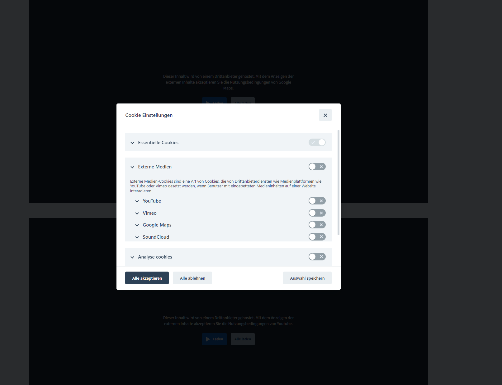

.. include:: ../Includes.txt

.. _introduction:

============
Introduction
============

An awesome simple cookie Manager for your Typo3 installation, with service and script management!

Key features
================
* Script Blocker / Script Management
* Lazy Load Iframes and Divs for Thirdparty Content
* Easy custom Implementation
* Standalone (no external dependencies needed)
* GDPR compliant
* Support for multi language (Currently DE/EN Preconfigured)
* WAI-ARIA compliant
* Allows you to define different cookie categories with opt in/out toggle
* Allows you to define custom cookie tables to specify the cookies you use

This plugin provides a solution for the EU Cookie law (ePrivacy, TTDSG). It allows loading of scripts, iframes, and content only after the user has given their consent.
However, you don't need to worry about the latest EU laws as this plugin manages your cookies.

..  youtube:: z-jsd9w4Dmg

Demo
----------

:ref:`Cookie-Manager, Frontend Demo: https://cookiedemo.coding-freaks.com/`

.. _screenshots:

Screenshots
===========

Frontend Preview of the Consent Manager

   Settings Modal.
