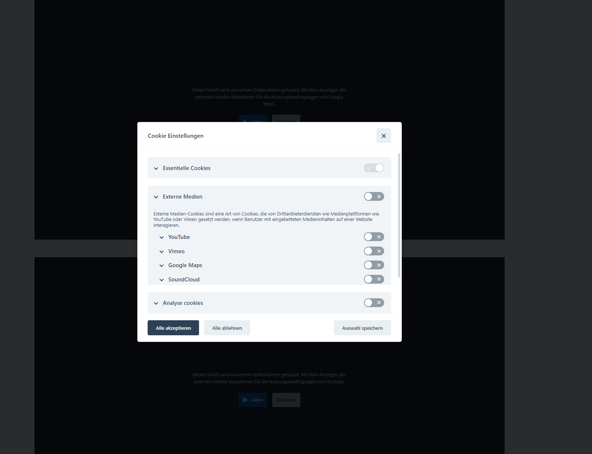

.. _introduction:

============
Introduction
============

An awesome simple cookie Manager for your Typo3 installation, with service and script management!

Key features
================
* Script Blocker / Script Management
* Lazy Load Iframes and Divs for Thirdparty Content
* Easy custom Implementation
* Standalone (no external dependencies needed)
* Support for multi language (Currently 9 Languages Preconfigured per API)
* WAI-ARIA attributes in the banner templates
* Allows you to define different cookie categories with opt in/out toggle
* Allows you to define custom cookie tables to specify the cookies you use
* Dark and Lightmode Support in the Typo3 v13 Backend

The extension holds back the scripts and iframes of the services you configure until the
visitor consents to them. Precisely:

*   A script with ``src`` or an iframe whose URL matches the provider of a service (one
    that is assigned to a category) is held back until the visitor consents to that
    service.
*   A script or iframe that matches no service loads as usual, unless
    ``script_blocking`` is on. Then it does not load at all, there is no consent button
    for it (see :ref:`extension-settings`).
*   Inline scripts without ``src`` are never changed. Put such code into the opt-in code
    of a service.
*   Only the HTML that TYPO3 delivers is rewritten. Scripts that other JavaScript adds to
    the page later are not.
*   With the Thumbnail API on, your server requests a preview image of a blocked iframe
    from the platform before consent (see :ref:`data-thumbnails`).

Which services need consent is for you to decide: the extension applies the configuration
you give it.

..  youtube:: z-jsd9w4Dmg

Demo
----------

`Cookie-Manager Frontend Demo <https://cookiedemo.coding-freaks.com/>`__

.. _introduction-platform:

With or without the CodingFreaks platform
=========================================

Version 2.x is open source and configured in TYPO3. The banner, its categories, services
and cookies live in your TYPO3 database, with or without an account on the CodingFreaks
platform.

**Without an account** you get:

*   the banner, categories, services, script and iframe blocking, consent tracking and the
    Dashboard widget
*   the presets from the cookie database (:guilabel:`Install Presets` or
    :guilabel:`Offline Configuration`) and the dataset update check in the
    :guilabel:`Administration` tab
*   the scanner in :guilabel:`Autoconfiguration & Reports`, within the limits the platform
    sets for scans without a key
*   the Thumbnail API, which the platform currently also answers without a key

**A free account** gives you a project on the platform. Its two credentials connect this
installation to that project:

*   scans run under your project and its limits
*   :guilabel:`Check API Integration` reports the extension to the project (version and
    last contact)
*   every save of a service, cookie, category or frontend record sends your banner
    configuration to the project, so the platform can compare its scan results with what
    your banner declares
*   thumbnail requests carry your credentials

What is sent, and when: :ref:`data-and-requests`.

Where to get the credentials
----------------------------

#.  Register at `app.coding-freaks.com <https://app.coding-freaks.com/register>`__ and
    create a project for your site.
#.  Open the project's integration assistant and choose TYPO3.
#.  Step 3 of the assistant (:guilabel:`Enter your API credentials`) shows
    :guilabel:`API Key` and :guilabel:`API Secret`.
#.  In TYPO3 the key goes into :guilabel:`Project ID (API key)`, the secret into
    :guilabel:`API secret`. Enter them in the API step of :guilabel:`Start Configuration`,
    in :guilabel:`Site Management > Settings`, or in :file:`settings.yaml`
    (see :ref:`extension-settings-versioned`).

.. important::

    The configuration stays in TYPO3. Assigning services on the platform does not change
    your banner. To take over what the scanner found, import the scan in TYPO3 under
    :guilabel:`Autoconfiguration & Reports`.

.. _screenshots:

Screenshots
===========

Frontend Preview of the Consent Manager

   Settings Modal.
