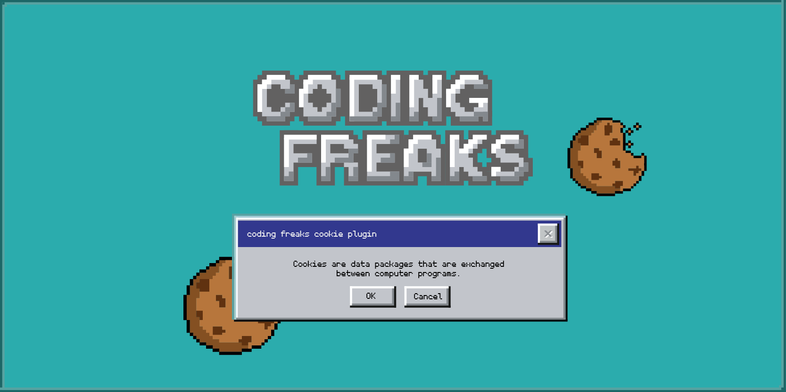

<!-- Improved compatibility of back to top link: See: https://github.com/othneildrew/Best-README-Template/pull/73 -->
<a name="readme-top"></a>
<!--
*** Thanks for checking out the Best-README-Template. If you have a suggestion
*** that would make this better, please fork the repo and create a pull request
*** or simply open an issue with the tag "enhancement".
*** Don't forget to give the project a star!
*** Thanks again! Now go create something AMAZING! :D
-->


<!-- PROJECT SHIELDS -->
<!--
*** I'm using markdown "reference style" links for readability.
*** Reference links are enclosed in brackets [ ] instead of parentheses ( ).
*** See the bottom of this document for the declaration of the reference variables
*** for contributors-url, forks-url, etc. This is an optional, concise syntax you may use.
*** https://www.markdownguide.org/basic-syntax/#reference-style-links
-->
[![Contributors][contributors-shield]][contributors-url]
[![Forks][forks-shield]][forks-url]
[![Stargazers][stars-shield]][stars-url]
[![Issues][issues-shield]][issues-url]
[![MIT License][license-shield]][license-url]
[![LinkedIn][linkedin-shield]][linkedin-url]
[](https://get.typo3.org/version/11)
[](https://get.typo3.org/version/12)
[](https://packagist.org/packages/codingfreaks/cf_cookiemanager)


<!-- PROJECT LOGO -->
<br />
<div align="center">
  <a href="https://github.com/eibiflo/cf_cookiemanager/">
    
  </a>

<h3 align="center">CodingFreaks Typo3 Cookie manager</h3>

  <p align="center">
    An awesome simple cookie Manager for your Typo3 installation, with service and script management!
    <br />
    <a href="https://docs.typo3.org/p/codingfreaks/cf-cookiemanager/main/en-us"><strong>Explore the docs »</strong></a>
    <br />
    <br />
    <a href="https://cookiedemo.coding-freaks.com/">View Demo</a>
    ·
    <a href="https://github.com/eibiflo/cf_cookiemanager/issues">Report Bug</a>
    ·
    <a href="https://github.com/eibiflo/cf_cookiemanager/issues">Request Feature</a>    
    ·
    <a href="https://extensions.typo3.org/extension/cf_cookiemanager">TER</a>
  </p>
</div>


<!-- ABOUT THE PROJECT -->

## About The Project

[![Product Name Screen Shot][product-screenshot]](https://github.com/eibiflo/cf_cookiemanager/)


We understand the struggle of finding the right cookie extension, which is why we've created this one with you in mind. Our goal is to make cookie management simple and efficient.

Here's what you can expect from our extension:

* Improved workflow: Our extension is designed to reduce the amount of time spent on repetitive tasks, allowing you to focus on the creative aspects of your work.


* Comprehensive solution: Our extension aims to be a comprehensive solution for your cookie management needs.
We appreciate your interest in our Cookie Manager extension and are committed to continuously improving it to provide the best possible experience. If you have any suggestions or feedback, please don't hesitate to reach out.

Thank you for considering our Cookie Manager extension. We hope it proves to be a valuable tool for you.


#### Join the Typo3-cfcookiemanager Slack chanel  <a href="https://typo3.slack.com/archives/C04NB2ZP30U">here</a>


<p align="right">(<a href="#readme-top">back to top</a>)</p>


<!-- GETTING STARTED -->

## Getting Started

  ```sh
  composer require codingfreaks/cf-cookiemanager
  ```

### Configuration


Ready to get the most out of the Cookie Manager extension? 

Check out our comprehensive configuration documentation by clicking the link below.
Get step-by-step guidance on how to set up and customize the extension to meet your specific needs. 

Don't miss out on unlocking its full potential! Click here for the <a href="https://docs.typo3.org/p/codingfreaks/cf-cookiemanager/main/en-us/Configuration/Index.html">Configuration guide</a>.


<p align="right">(<a href="#readme-top">back to top</a>)</p>


<!-- ROADMAP -->

## Roadmap

- [x] Multi-language Support
  - [x] Custom Language overlay import
  - [x] Auto Language Import from Site Configuration and Codingfreaks Cookie API
- [x] Basic Autoconfiguration
- [x] Backend UI optimization
- [x] Add multi-tree Support and multiple storage folders
- [x] Anonym optin/optout Statistics as a Dashboard widget
- [ ] Add cookie Templates or a Template Designer
- [ ] Add more static Services
- [ ] Advanced Autoconfiguration with better multi-tree Support and mm Relation Management


See the [open issues](https://github.com/eibiflo/cf_cookiemanager/issues) for a full list of proposed features (
and known issues).

<p align="right">(<a href="#readme-top">back to top</a>)</p>


<!-- LICENSE -->

## License

Distributed under the GNU GENERAL PUBLIC LICENSE License. See `LICENSE.txt` for more information.
<p align="right">(<a href="#readme-top">back to top</a>)</p>


<!-- MARKDOWN LINKS & IMAGES -->
<!-- https://www.markdownguide.org/basic-syntax/#reference-style-links -->

[contributors-shield]: https://img.shields.io/github/contributors/eibiflo/cf_cookiemanager.svg?style=for-the-badge

[contributors-url]: https://github.com/eibiflo/cf_cookiemanager/graphs/contributors

[forks-shield]: https://img.shields.io/github/forks/eibiflo/cf_cookiemanager.svg?style=for-the-badge

[forks-url]: https://github.com/eibiflo/cf_cookiemanager/network/members

[stars-shield]: https://img.shields.io/github/stars/eibiflo/cf_cookiemanager.svg?style=for-the-badge

[stars-url]: https://github.com/eibiflo/cf_cookiemanager/stargazers

[issues-shield]: https://img.shields.io/github/issues/eibiflo/cf_cookiemanager.svg?style=for-the-badge

[issues-url]: https://github.com/eibiflo/cf_cookiemanager/issues

[license-shield]: https://img.shields.io/github/license/eibiflo/cf_cookiemanager.svg?style=for-the-badge

[license-url]: https://github.com/eibiflo/cf_cookiemanager/blob/master/LICENSE.txt

[linkedin-shield]: https://img.shields.io/badge/-LinkedIn-black.svg?style=for-the-badge&logo=linkedin&colorB=555

[linkedin-url]: https://linkedin.com/in/florian-e-676399205

[product-screenshot]: Documentation/Images/cookie_settings.png